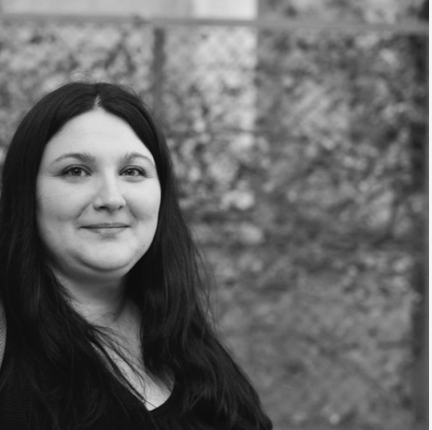
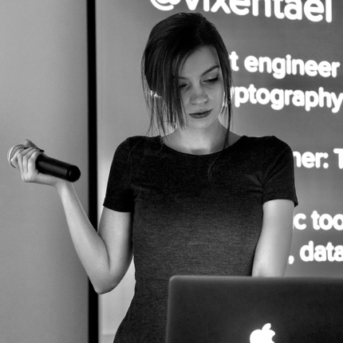
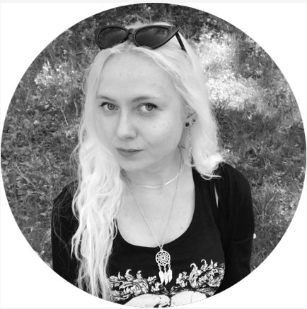
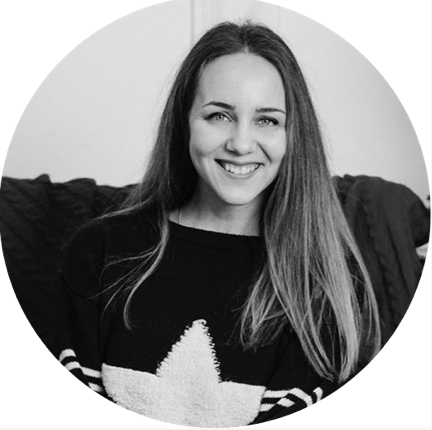
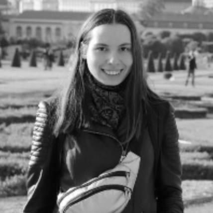
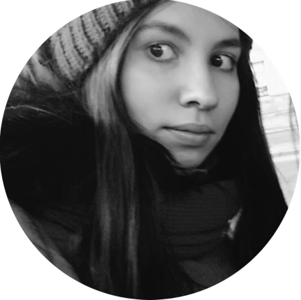
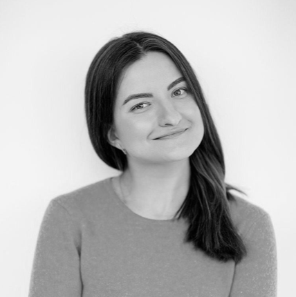
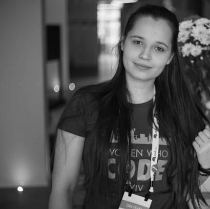

# Стріми у Women Who Code Kyiv

Ми працюємо у декількох напрямках – стрімах технічного і нетехнічного характеру. Приклади стрімів – QA, Data Science, Cybersecurity, Cocoa (iOS/macOS), Менторська програма.

Кожен стрім – це команда однодумців, які разом влаштовують мітапи, панельні дискусії чи просто посиденьки за чаєм, ведуть канал у нашому слаці (до речі, [приєднуйтеся](http://bit.ly/wwcodeKyivSlack)), допомагають новачкам і так далі.

Кожен стрім має одну чи декілька лідерок — до них ви можете звертатися з запитаннями щодо роботи напрямку.

## QA

 Slack channel: [#qa_main](https://wwcodekyiv.slack.com/archives/C413YLQDD)

### Anna Lazareva

QA Manager in Luxoft

 [Anna Lazareva on WWCode Kyiv Slack](https://wwcodekyiv.slack.com/team/U41AP8LP5)

 [Anna Lazareva on LinkedIn](https://wwcodekyiv.slack.com/team/U41AP8LP5)

## Cybersecurity

 Slack channel: [#security](https://wwcodekyiv.slack.com/archives/CD69WRPAN)

### Anastasiia Voitova

Security Software Engineer @Cossack Labs. Product security, cryptography.

 [Anastasiia Voitova on WWCode Kyiv Slack](https://wwcodekyiv.slack.com/team/U3W2CSK5X)

 [Anastasiia Voitova on LinkedIn](https://www.linkedin.com/in/anastasiiavoitova/)

### Julia Potapenko

Security Software Engineer @CossackLabs

  [Julia Potapenko on WWCode Kyiv Slack](https://wwcodekyiv.slack.com/team/U8GS7F4BT)

 [Julia Potapenko on LinkedIn](https://www.linkedin.com/in/jpotapenko/)

## Cocoa (iOS/macOS)

### Maria Holubieva

iOS/macOS Senior Engineer, Cocoa Area Lead @MacPaw

 [Maria Holubieva on WWCode Kyiv Slack](https://wwcodekyiv.slack.com/team/U4EJ5GE0Z)

 [Maria Holubieva on LinkedIn](https://www.linkedin.com/in/mk-holubieva/)

## Data Science & Data Engineering

 Slack channel: [#data_engineering](https://wwcodekyiv.slack.com/archives/C9JG6NV88)

### Roksolana Diachuk

Data Engineering Lead, Big Data Engineer @Captify, Speaker

 [Roksolana Diachuk on WWCode Kyiv Slack](https://wwcodekyiv.slack.com/team/U3WMAKVH9)

 [Roksolana Diachuk on LinkedIn](https://www.linkedin.com/in/roksolanadiachuk/)

### Marianna Diachuk

Data Science Lead, data scientist

 [Marianna Diachuk on WWCode Kyiv Slack](https://wwcodekyiv.slack.com/team/U3WLYJV2P)

 [Marianna Diachuk on LinkedIn](https://www.linkedin.com/in/marianna-diachuk-53ba60116/)

## Project Management

 Slack channel: [#projectmanagers](https://wwcodekyiv.slack.com/archives/CPKF58QNP)

### Yana Zubkova

QA Manager @BCD Travel; QA Consultant; Mentor

 [Yana Zubkova on WWCode Kyiv Slack](https://wwcodekyiv.slack.com/team/UGSMCEE8Y)

 [Yana Zubkova on LinkedIn](https://www.linkedin.com/in/zubkova/)

## IoT

### Tetiana Boichenko

C++ Engineer

 [Tetiana Boichenko on WWCode Kyiv Slack](https://wwcodekyiv.slack.com/team/U4CSTR4CB)

 [Tetiana Boichenko on LinkedIn](https://www.linkedin.com/in/tetianaboichenko)

## Менторська програма

### Maria Holubieva

iOS/macOS Senior Engineer, Cocoa Area Lead @MacPaw

 [Maria Holubieva on WWCode Kyiv Slack](https://wwcodekyiv.slack.com/team/U4EJ5GE0Z)

 [Maria Holubieva on LinkedIn](https://www.linkedin.com/in/mk-holubieva/)

